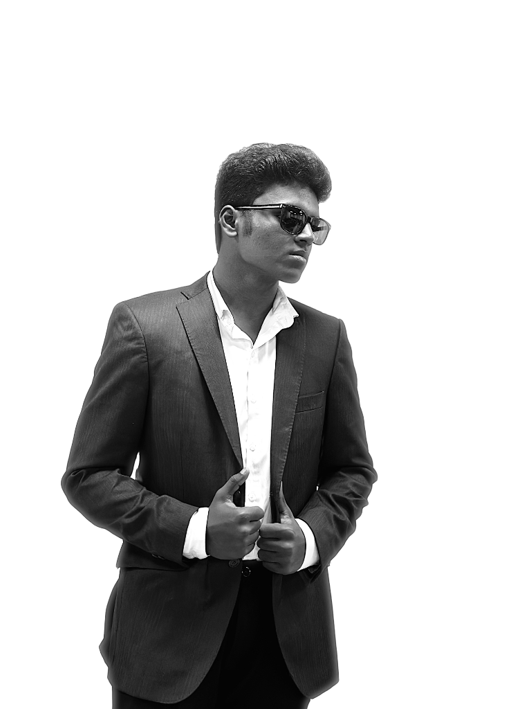

# ✨ Shyamalan V — Cinematic Interactive Digital Portfolio

<div align="center">



### **Builder · Software Developer · Creative Technologist**
*Turning ambitious ideas into software, AI pipelines, AR/VR virtual spaces, and high-performance digital products.*

[](https://nextjs.org/)
[](https://react.js.org/)
[](https://www.typescriptlang.org/)
[](https://threejs.org/)
[](https://tailwindcss.com/)
[](https://www.framer.com/motion/)

[Live Demo](#) · [LeetCode Profile](https://leetcode.com/u/Shyamalan_21/) · [LinkedIn](https://www.linkedin.com/in/shyamalanv/) · [GitHub](https://github.com/Shyamalan-21)

---

</div>

## 🌌 Overview

This repository houses the personal portfolio and interactive digital identity platform of **Shyamalan V**, a Computer Science & Gaming Technology engineer at SRM University.

Departing from conventional static resume websites, this platform is built as an **immersive cinematic experience**: featuring real-time 3D particle constellations, dynamic horizontal scroll drawers, an organic growing experience timeline, and a live LeetCode algorithmic laboratory with an interactive binary search visualizer.

---

## ⚡ Key Highlights & Features

### 1. 🚀 3D Particle Space & Cinematic Hero
- **Interactive Three.js Canvas**: Floating wireframe icosahedrons, orbit rings, and 2,500 interactive constellation particles responsive to mouse movements.
- **Maximized Portrait Cutout**: Clean, frameless editorial photography with an ambient neon back-glow and glassmorphic identity badge.
- **Parallax Typography**: Dual-speed scroll-driven kinetic background typography (*"COMPUTER SCIENCE ENGINEER · CREATIVE TECHNOLOGIST"*).

### 2. 🎛️ Real-Time DSA Problem Lab & LeetCode Stream
- **Live GraphQL Integration**: Real-time stats fetched dynamically from official LeetCode GraphQL APIs with cached fallbacks.
- **Submission Frequency Heatmap**: 98-day continuous streak matrix dynamically colored based on daily problem-solving density.
- **Interactive Binary Search Simulator**: Fully playable step-by-step $O(\log n)$ array search visualizer with color-coded bounds (`L`, `MID`, `R`) and live execution terminal.

### 3. 💼 Horizontal Scroll Project Showcases
- **Accordion Architecture Drawers**: Smooth 60+ FPS hardware-accelerated drawer expansion on hover showcasing:
  - **VeriTrust-AI**: Multi-agent developer credibility scoring engine with LangGraph & SHAP explainability.
  - **Bizpulse**: Full-stack freelance fintech SaaS with automated GST invoicing and cash flow analytics.
  - **Beaute-AI**: Computer vision facial geometry scanning and Google Gemini AI beauty intelligence.
  - **iLab XR Simulation**: Award-winning immersive VR lathe & mechanical workshop framework.

### 4. 🌿 Evolutionary Growth Experience Timeline
- **Organic Branching Trunk**: Vertical growth line animated on scroll with sprouting milestone buds.
- **Academic & Industry Roles**: Features AR/VR engineering at SVCE, Chief Video Editor at Andropedia, and international best paper publications.

### 5. 🏷️ Dual Opposite-Sliding Technical Stack Marquees
- **Brand-Themed Badges**: 24+ technical competencies sliding in opposite horizontal marquee rows.
- **Category Drawers**: Expandable skill categories with animated proficiency meters (AI/LLMs, Spatial 3D, Systems, Frontend, Databases).

### 6. 🎨 Micro-Interactions & Aesthetics
- **Interactive Comet Mouse Trail**: Canvas-based radial glow tail with screen blend modes.
- **Inverting Custom Cursor**: Magnetic cursor with `mix-blend-mode: difference`.
- **Futuristic Boot Sequence**: 1.8s progressive loading screen with live diagnostic stage indicators.
- **Floating Glassmorphic Navbar**: Capsule navigation bar with backdrop blur and active section tracking.

---

## 🛠️ Technology Stack

| Domain | Technologies |
|---|---|
| **Core Framework** | Next.js 15+ (App Router), React 19, TypeScript |
| **3D & Canvas** | Three.js, `@react-three/fiber`, `@react-three/drei` |
| **Styling & Design** | Tailwind CSS v4, Vanilla CSS Design Tokens, PostCSS |
| **Animations** | Framer Motion, Hardware-Accelerated CSS Transitions |
| **Icons & Typography** | Lucide React, Google Fonts (*Bebas Neue*, *Outfit*, *Space Grotesk*, *JetBrains Mono*) |
| **Data APIs** | LeetCode GraphQL, Next.js Edge API Routes |

---

## 📂 Project Architecture

```
Portfolio/
├── public/
│   ├── profile.jpg             # High-resolution portrait cutout
│   └── favicon.ico
├── src/
│   ├── app/
│   │   ├── api/
│   │   │   └── leetcode/
│   │   │       └── route.ts    # Live LeetCode GraphQL & mirror endpoint
│   │   ├── globals.css         # Custom tokens, marquees & glassmorphism
│   │   ├── layout.tsx          # Font optimization & SEO metadata
│   │   └── page.tsx            # Main layout & component sequence
│   ├── components/
│   │   ├── Hero.tsx            # 3D canvas & landing presentation
│   │   ├── About.tsx           # Philosophy & background chapters
│   │   ├── Projects.tsx        # Horizontal accordion project showcase
│   │   ├── Experience.tsx      # Growing tree-like timeline
│   │   ├── DSALab.tsx          # Live LeetCode stats & binary search visualizer
│   │   ├── Skills.tsx          # Dual marquees & expandable skill drawers
│   │   ├── Achievements.tsx    # Awards & conference publication cases
│   │   ├── BeyondCode.tsx      # Multidisciplinary pursuits & education
│   │   ├── Contact.tsx         # Message transmission & social links
│   │   ├── NavBar.tsx          # Floating glassmorphic navigation
│   │   ├── LoadingScreen.tsx   # 3D boot sequence with progress diagnostics
│   │   ├── MouseTrail.tsx      # Canvas comet particle trail
│   │   └── CustomCursor.tsx    # Inverted magnetic cursor
│   └── lib/
│       └── utils.ts            # Class merging & utility helpers
├── package.json
├── tsconfig.json
└── README.md
```

---

## 🚀 Getting Started Locally

### Prerequisites
- **Node.js**: v18.17.0 or higher
- **npm** or **pnpm** or **yarn**

### Installation

1. **Clone the repository**:
   ```bash
   git clone https://github.com/Shyamalan-21/Portfolio.git
   cd Portfolio
   ```

2. **Install dependencies**:
   ```bash
   npm install
   ```

3. **Start the development server**:
   ```bash
   npm run dev
   ```

4. **Open in browser**:
   Navigate to [http://localhost:3000](http://localhost:3000) to view the live application.

5. **Production Build**:
   ```bash
   npm run build
   npm run start
   ```

---

## 📬 Connect & Collaborate

- **Email**: [samzshyam21@gmail.com](mailto:samzshyam21@gmail.com)
- **LinkedIn**: [linkedin.com/in/shyamalanv](https://www.linkedin.com/in/shyamalanv/)
- **GitHub**: [github.com/Shyamalan-21](https://github.com/Shyamalan-21)
- **LeetCode**: [leetcode.com/u/Shyamalan_21](https://leetcode.com/u/Shyamalan_21/)

---

<div align="center">
  <sub>© 2026 Shyamalan V. Designed and engineered with passion for code, craft, and interactive media.</sub>
</div>
